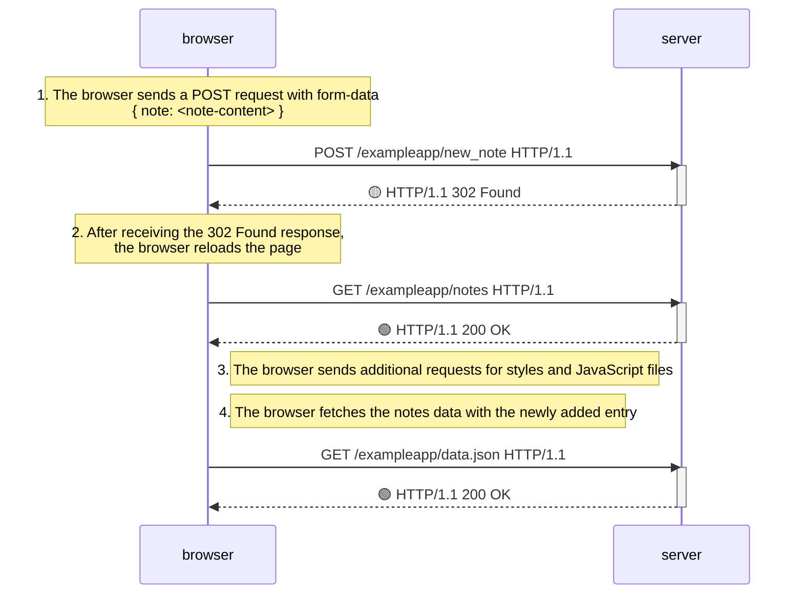
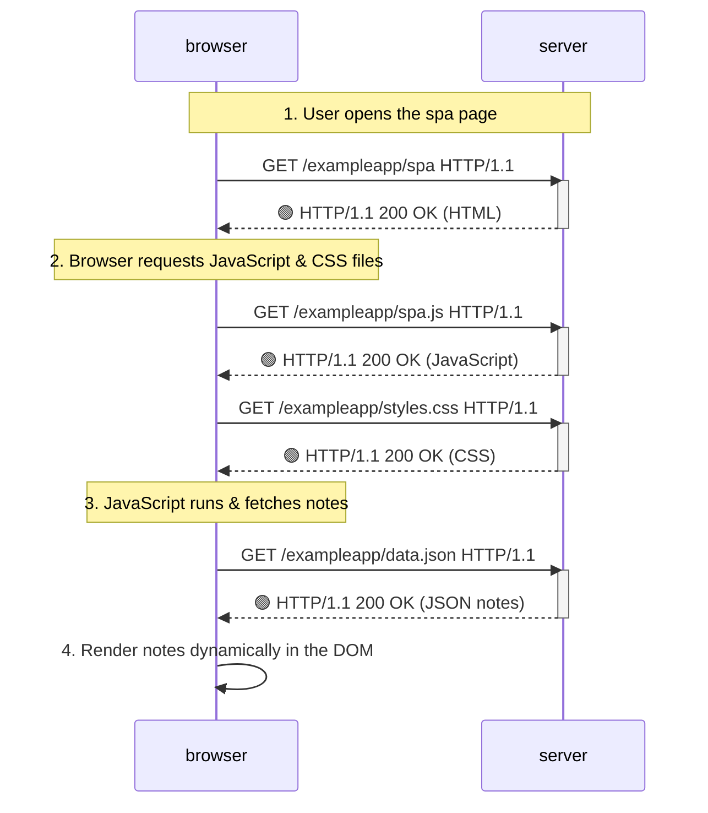
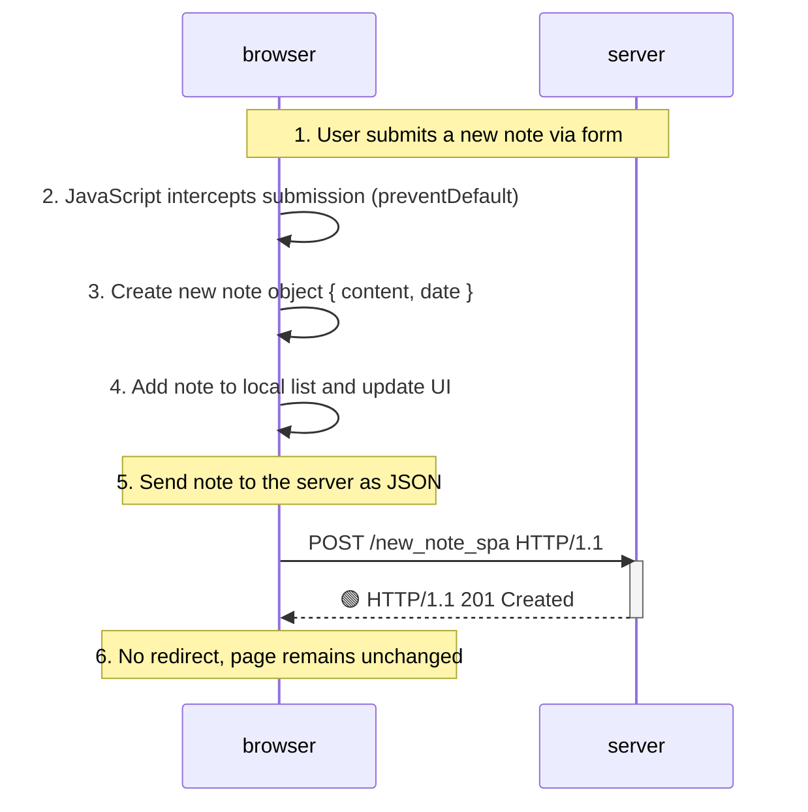

# Part 0: Fundamentals of Web Applications

## Task 1: New Note Diagram

### Steps:
1. Browser sends a `POST` request with form-data containing the new note.
2. Server responds with `302 Found`, redirecting the browser.
3. Browser reloads the page by sending a `GET` request for the notes page.
4. Server responds with `200 OK`, sending the updated page.
5. Browser makes additional requests for styles and JavaScript files.
6. Browser fetches the updated notes data from the server.

## Task 2: Single Page App - Homepage Loading

### Steps:
1. User opens the SPA homepage in their browser.
2. Browser sends a `GET` request for the main HTML file.
3. Server responds with the HTML file.
4. Browser sends additional `GET` requests for the required JavaScript and CSS files.
5. Server responds with the requested files.
6. JavaScript code runs in the browser, fetching existing notes as JSON.
7. Browser dynamically renders the notes on the page without additional page loads.

## Task 3: New note in Single page app diagram

### Steps:
1. User submits a new note in the form.
2. JavaScript intercepts the form submission and prevents the default page reload.
3. A new note object is created and added to the notes list in the browser.
4. Page is updated dynamically to show the new note.
5. Note is sent to the server as a `POST` request with JSON data.
6. Server responds with `201 Created`, confirming successful storage.
7. Browser remains on the same page without additional requests.

